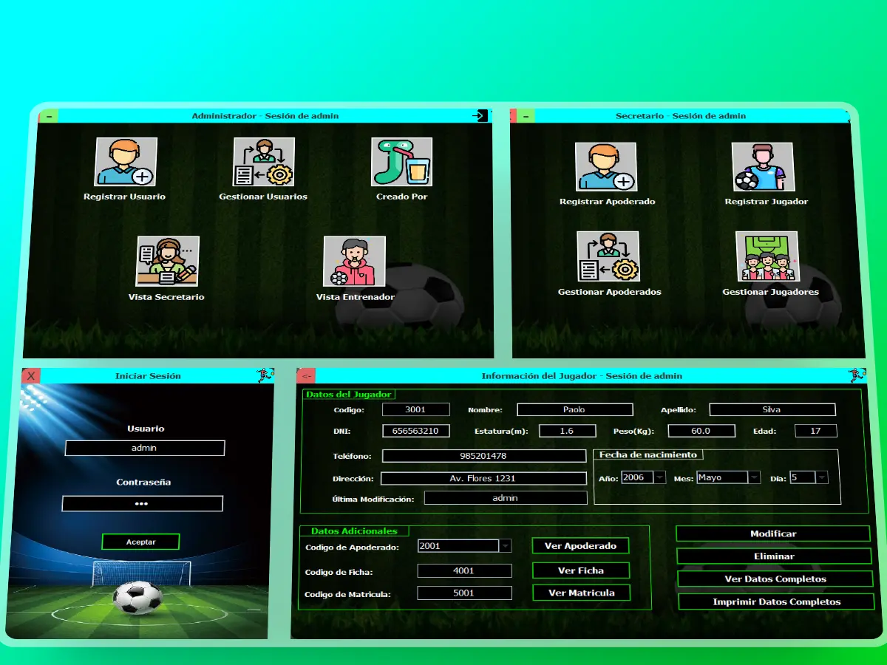

# BrightStudentApp - Software para academias de fútbol

Un _software_ hecho con _**Java**_ y uso de archivos planos (_.txt_) para la persistencia de los datos.

## Ejecutar proyecto

1. Clonar proyecto y abrir en el _IDE_ preferido o Eclipse (recomendado)
2. Ejecutar el archivo **Bienvenida.java** que es el punto de entrada
3. Revisar el archivo **Usuarios.txt** para obtener las credenciales por defecto, **usuario:** _antepenúltimo dato, **contraseña:** \_penúltimo dato_

 <strong> by jmedinalezama </strong> 👨‍💻

